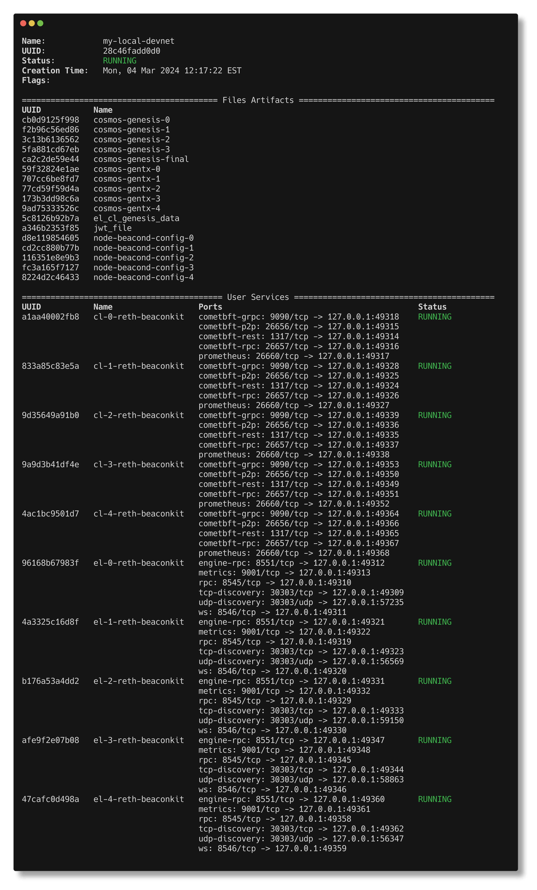

# Running BeaconKit with Kurtosis

## What is Kurtosis

[Kurtosis](https://www.kurtosis.com/) is a platform for running distributed
systems on Docker / Kubernetes. It provides a simple, powerful framework for
spinning up and tearing down distributed systems programmatically.

## How to Use

To use BeaconKit with Kurtosis, you'll first need to install the Kurtosis CLI
and its dependencies. You can find instructions for doing so
[here](https://docs.kurtosis.com/install).

### Docker/local environment

Once you've installed the Kurtosis CLI, you can use it to spin up a Beacon
network with the following command from within the root directory of the
beacon-kit repo:

```bash
make start-devnet
```

This will automatically build your beacon docker image from the local source
code, and spin up a Kurtosis network based on the config file in
`kurtosis/beaconkit-all.yaml`. Once complete, this will output all the
network information for your nodes like so:



When you want to tear down your network, you can do so
with the following commands:

```bash
make stop-devnet
make rm-devnet
```

And that's it!

### GCP/remote environment

#### Requirements: GCP access

Ask for GCP access in #devops if you need it.

Set Kurtosis to run with cloud(GCP)/remote:

```bash
kurtosis cluster set minikube
```

Run the Kurtosis port forward to be able to start your devnet:

```bash
kurtosis gateway
```

Once you've installed the Kurtosis CLI, you can use it to spin up a Beacon
network with the following command from within the root directory of the
beacon-kit repo:

```bash
make start-gcp-devnet-no-build
```

When you want to tear down your network, you can do so
with the following commands:

```bash
make stop-gcp-devnet
```

## Cheat sheet

When you have killed a pod/component (in that example:
cl-validator-beaconkit-0), restart it with that command:

```bash
kurtosis service start my-local-devnet cl-validator-beaconkit-0
```

Set kurtosis to run with local docker:

```bash
kurtosis cluster set docker
```

Set Kurtosis to run with cloud(GCP)/remote:

```bash
kurtosis cluster set minikube
```
